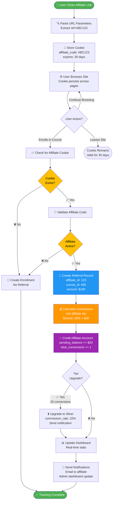
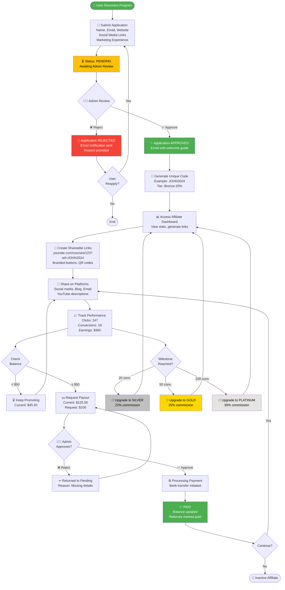
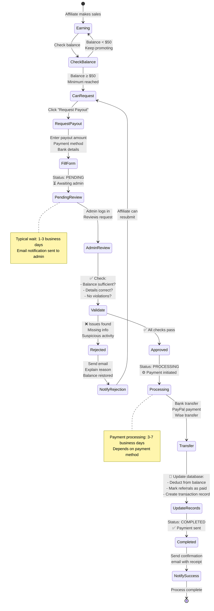
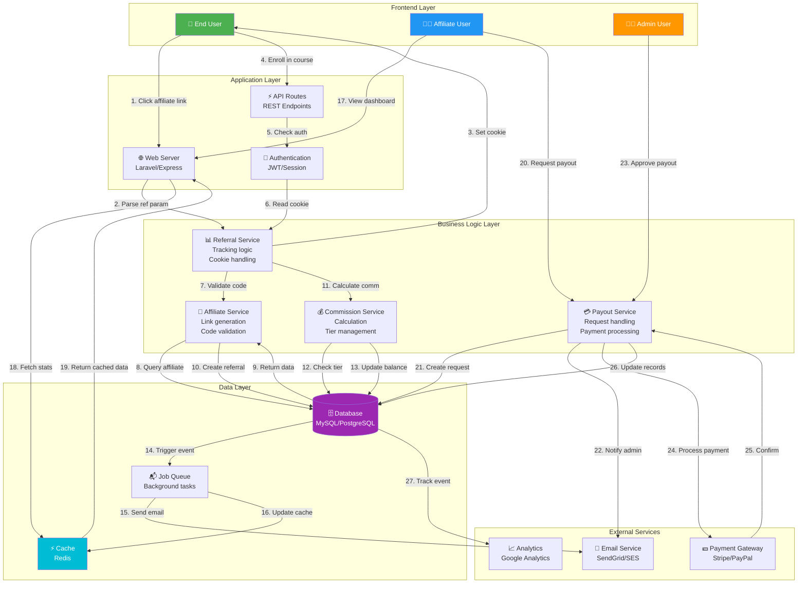

# Affiliate System Visual Documentation

## 1. 🔗 Referral Tracking Flow (Technical Process)

This diagram shows the complete technical flow of how a referral is tracked from link click to commission credit.



**Example Flow:**
```
User clicks: yoursite.com/courses/web-dev-101?ref=JOHN2024
↓
Cookie stored: {affiliate_code: "JOHN2024", created_at: "2024-01-15"}
↓
User browses 3 different course pages (cookie persists)
↓
User enrolls in "Web Dev 101" - $100 course
↓
System finds cookie, validates JOHN2024 is active
↓
Creates referral record #1523
↓
John is Bronze tier (20%) → Commission: $20
↓
John's stats: Pending Balance: $65.50, Total Conversions: 4
↓
Dashboard updated instantly ✅
```

---

## 2. 🚀 Affiliate Journey Flowchart (User Experience)

This shows the complete lifecycle of an affiliate from application to payout.



---

## 3. 🏆 Commission Tier Ladder

Visual hierarchy showing the progression and earning potential at each tier.

```
┌─────────────────────────────────────────────────────────────────┐
│                    💎 PLATINUM TIER (30%)                        │
│                    ≥ 100 Conversions                             │
│  ┌────────────────────────────────────────────────────────────┐ │
│  │ Example: 120 conversions × $100 avg = $12,000              │ │
│  │ Your Commission: $3,600 💰                                  │ │
│  │ Per Sale: $30                                               │ │
│  └────────────────────────────────────────────────────────────┘ │
└─────────────────────────────────────────────────────────────────┘
                              ⬆️
┌─────────────────────────────────────────────────────────────────┐
│                     🥇 GOLD TIER (25%)                           │
│                    50-99 Conversions                             │
│  ┌────────────────────────────────────────────────────────────┐ │
│  │ Example: 75 conversions × $100 avg = $7,500                │ │
│  │ Your Commission: $1,875 💰                                  │ │
│  │ Per Sale: $25                                               │ │
│  │                                                             │ │
│  │ 🎯 Next Goal: 25 more conversions → PLATINUM (+5%)         │ │
│  └────────────────────────────────────────────────────────────┘ │
└─────────────────────────────────────────────────────────────────┘
                              ⬆️
┌─────────────────────────────────────────────────────────────────┐
│                    🥈 SILVER TIER (22%)                          │
│                    20-49 Conversions                             │
│  ┌────────────────────────────────────────────────────────────┐ │
│  │ Example: 35 conversions × $100 avg = $3,500                │ │
│  │ Your Commission: $770 💰                                    │ │
│  │ Per Sale: $22                                               │ │
│  │                                                             │ │
│  │ 🎯 Next Goal: 15 more conversions → GOLD (+3%)             │ │
│  └────────────────────────────────────────────────────────────┘ │
└─────────────────────────────────────────────────────────────────┘
                              ⬆️
┌─────────────────────────────────────────────────────────────────┐
│                    🥉 BRONZE TIER (20%)                          │
│                    0-19 Conversions                              │
│  ┌────────────────────────────────────────────────────────────┐ │
│  │ Example: 10 conversions × $100 avg = $1,000                │ │
│  │ Your Commission: $200 💰                                    │ │
│  │ Per Sale: $20                                               │ │
│  │                                                             │ │
│  │ 🎯 Next Goal: 10 more conversions → SILVER (+2%)           │ │
│  └────────────────────────────────────────────────────────────┘ │
│                   ⭐ STARTING TIER - Welcome!                    │
└─────────────────────────────────────────────────────────────────┘
```

**Comparison Table:**

| Tier | Rate | Conversions | Per $100 Sale | Per $200 Sale | Annual Potential* |
|------|------|-------------|---------------|---------------|-------------------|
| 🥉 Bronze | 20% | 0-19 | $20 | $40 | $2,400 |
| 🥈 Silver | 22% | 20-49 | $22 | $44 | $5,280 |
| 🥇 Gold | 25% | 50-99 | $25 | $50 | $15,000 |
| 💎 Platinum | 30% | 100+ | $30 | $60 | $36,000+ |

*Based on 120 sales/year at $100 average course price

---

## 4. 💳 Payout Process Diagram

Shows the complete workflow from payout request to completion.



**Payout Request Flow (Step-by-Step):**

```
Step 1: ELIGIBILITY CHECK
├─ Current Balance: $125.50
├─ Minimum Required: $50.00
└─ ✅ Can Request: YES

Step 2: AFFILIATE SUBMITS REQUEST
├─ Amount: $100.00
├─ Method: Bank Transfer
├─ Bank: Chase Bank
├─ Account: ****1234
└─ Status: ⏳ PENDING

Step 3: ADMIN NOTIFICATION
├─ 📧 Email sent to admin@yoursite.com
├─ Dashboard alert: "1 new payout request"
└─ Request #2024-001 appears in queue

Step 4: ADMIN REVIEW
├─ Affiliate: John Doe (JOHN2024)
├─ Tier: Silver (22%)
├─ Total Conversions: 35
├─ Requested: $100.00
├─ Available: $125.50
├─ Last Payout: 2024-12-15
└─ Decision: ✅ APPROVE

Step 5: PROCESSING
├─ Status changed to: ⚙️ PROCESSING
├─ Bank transfer initiated
├─ Reference: PAY-2024-001-JOHN
└─ ETA: 3-5 business days

Step 6: DATABASE UPDATE
├─ Deduct: $125.50 - $100.00 = $25.50
├─ Mark 35 referrals as "paid"
├─ Create transaction record
└─ Update payment history

Step 7: COMPLETION
├─ Status: ✅ COMPLETED
├─ Payment sent: $100.00
├─ New balance: $25.50
├─ 📧 Receipt emailed
└─ Ready for next cycle
```

---

## 5. 🏗️ Data Flow Architecture

System-level view of how data moves through the affiliate system.



**Data Flow Example (End-to-End):**

```
[User Action] Click: yoursite.com/courses/web-dev?ref=JOHN2024
    ↓
[Request] GET /courses/web-dev?ref=JOHN2024
    ↓
[Middleware] Extract ref parameter → "JOHN2024"
    ↓
[Cookie Service] Set cookie: {affiliate_code: "JOHN2024", expires: 30d}
    ↓
[Response] Return course page + cookie
    ↓
[User Action] Click "Enroll Now" → Course: $100
    ↓
[Request] POST /api/enrollments {course_id: 123, user_id: 456}
    ↓
[Auth Middleware] Verify user logged in ✅
    ↓
[Referral Service] Read cookie → Find "JOHN2024"
    ↓
[Database Query] SELECT * FROM affiliates WHERE code='JOHN2024'
    ↓
[Result] {id: 789, code: "JOHN2024", tier: "bronze", rate: 0.20, status: "active"}
    ↓
[Referral Service] Create referral record:
    {
      affiliate_id: 789,
      user_id: 456,
      course_id: 123,
      amount: 100,
      commission: 20,
      status: "pending"
    }
    ↓
[Commission Service] Calculate: $100 × 20% = $20
    ↓
[Database Update] UPDATE affiliates SET pending_balance += 20 WHERE id=789
    ↓
[Background Job] Queue: SendAffiliateNotificationJob
    ↓
[Email Service] Send: "You earned $20 from a new referral!"
    ↓
[Cache] Update dashboard stats in Redis
    ↓
[Analytics] Track event: "referral_created"
    ↓
[Response] Return success to user
```

---

## 6. 📊 Admin Dashboard Overview

Layout and functionality of the admin control panel.

```
╔════════════════════════════════════════════════════════════════════════╗
║  🏠 AFFILIATE ADMIN DASHBOARD                    👤 Admin | 🔔 (3) | ⚙️  ║
╠════════════════════════════════════════════════════════════════════════╣
║                                                                        ║
║  📈 SYSTEM METRICS (Last 30 Days)                                      ║
║  ┌──────────────┬──────────────┬──────────────┬──────────────┐       ║
║  │ 💰 Revenue   │ 🔗 Affiliates│ 📊 Referrals │ 💳 Payouts   │       ║
║  │ $12,450.75   │ 47 Active    │ 523 Total    │ $3,200 Paid  │       ║
║  │ ⬆️ +15.3%     │ 🕐 12 Pending│ ✅ 450 Paid   │ ⏳ 5 Pending  │       ║
║  └──────────────┴──────────────┴──────────────┴──────────────┘       ║
║                                                                        ║
║  ⏳ PENDING AFFILIATE APPLICATIONS (12)              [View All →]     ║
║  ┌────────────────────────────────────────────────────────────────┐  ║
║  │ 👤 Sarah Johnson                    Applied: 2 hours ago       │  ║
║  │    sarah@example.com | Instagram: @sarahcodes (12K followers) │  ║
║  │    Experience: Tech blogger, 3 years                           │  ║
║  │    [✅ Approve] [❌ Reject]  [👁️ View Details]                   │  ║
║  ├────────────────────────────────────────────────────────────────┤  ║
║  │ 👤 Mike Chen                        Applied: 5 hours ago       │  ║
║  │    mike@example.com | YouTube: MikeTech (45K subs)            │  ║
║  │    Experience: Course creator, 5 years                         │  ║
║  │    [✅ Approve] [❌ Reject]  [👁️ View Details]                   │  ║
║  ├────────────────────────────────────────────────────────────────┤  ║
║  │ 👤 Lisa Martinez                    Applied: 1 day ago         │  ║
║  │    lisa@example.com | Website: techlearning.com               │  ║
║  │    Experience: Email list (5K subscribers)                     │  ║
║  │    [✅ Approve] [❌ Reject]  [👁️ View Details]                   │  ║
║  └────────────────────────────────────────────────────────────────┘  ║
║                                                                        ║
║  💳 PENDING PAYOUT REQUESTS (5)                      [View All →]     ║
║  ┌────────────────────────────────────────────────────────────────┐  ║
║  │ Request #2024-045                   Requested: 3 hours ago     │  ║
║  │ 👤 John Doe (JOHN2024) | 🥈 Silver Tier                        │  ║
║  │ 💰 Amount: $150.00 | Available: $180.50 | Method: Bank        │  ║
║  │ 📊 Stats: 35 conversions, Member since: Jan 2024              │  ║
║  │ [✅ Approve] [❌ Reject]  [💬 Message]  [👁️ View History]        │  ║
║  ├────────────────────────────────────────────────────────────────┤  ║
║  │ Request #2024-044                   Requested: 1 day ago       │  ║
║  │ 👤 Emma Wilson (EMMA2024) | 🥇 Gold Tier                       │  ║
║  │ 💰 Amount: $500.00 | Available: $525.30 | Method: PayPal      │  ║
║  │ 📊 Stats: 67 conversions, Member since: Nov 2023              │  ║
║  │ [✅ Approve] [❌ Reject]  [💬 Message]  [👁️ View History]        │  ║
║  └────────────────────────────────────────────────────────────────┘  ║
║                                                                        ║
║  🏆 TOP PERFORMERS (This Month)                      [View All →]     ║
║  ┌────────────────────────────────────────────────────────────────┐  ║
║  │ 1. 💎 David Kumar (DAVID2024)      | 45 conversions | $1,350  │  ║
║  │ 2. 🥇 Emma Wilson (EMMA2024)       | 38 conversions | $950    │  ║
║  │ 3. 🥈 John Doe (JOHN2024)          | 22 conversions | $484    │  ║
║  └────────────────────────────────────────────────────────────────┘  ║
║                                                                        ║
║  📊 RECENT ACTIVITY                                  [View All →]     ║
║  • 🎉 David Kumar reached Platinum tier (2 min ago)                   ║
║  • 💰 New referral: $100 commission for Emma Wilson (15 min ago)      ║
║  • 📝 New application: Sarah Johnson (2 hours ago)                    ║
║  • ✅ Payout completed: $300 to Michael Brown (3 hours ago)           ║
║  • 🥈 John Doe upgraded to Silver tier (5 hours ago)                  ║
║                                                                        ║
╚════════════════════════════════════════════════════════════════════════╝
```

**Admin Action Buttons:**
```
┌─────────────────────────────────────────────────────────┐
│  QUICK ACTIONS                                          │
├─────────────────────────────────────────────────────────┤
│  [📝 Review Applications (12)]  [💳 Process Payouts (5)] │
│  [📊 View All Affiliates]       [📈 Analytics Report]   │
│  [⚙️ System Settings]           [📧 Send Announcement]  │
│  [🚫 Block Affiliate]           [💰 Adjust Commission]  │
└─────────────────────────────────────────────────────────┘
```

---

## 7. 🎨 User Interface Mockup Descriptions

### 7.1 Affiliate Registration Form

```
╔══════════════════════════════════════════════════════════════╗
║           JOIN OUR AFFILIATE PROGRAM 🚀                      ║
║        Earn 20-30% commission on every referral!             ║
╠══════════════════════════════════════════════════════════════╣
║                                                              ║
║  PERSONAL INFORMATION                                        ║
║  ┌────────────────────────────────────────────────────────┐ ║
║  │ Full Name *                                            │ ║
║  │ [________________________________]                     │ ║
║  └────────────────────────────────────────────────────────┘ ║
║                                                              ║
║  ┌────────────────────────────────────────────────────────┐ ║
║  │ Email Address *                                        │ ║
║  │ [________________________________]                     │ ║
║  └────────────────────────────────────────────────────────┘ ║
║                                                              ║
║  ┌────────────────────────────────────────────────────────┐ ║
║  │ Phone Number (optional)                                │ ║
║  │ [________________________________]                     │ ║
║  └────────────────────────────────────────────────────────┘ ║
║                                                              ║
║  ONLINE PRESENCE                                             ║
║  ┌────────────────────────────────────────────────────────┐ ║
║  │ Website URL (if applicable)                            │ ║
║  │ [________________________________]                     │ ║
║  └────────────────────────────────────────────────────────┘ ║
║                                                              ║
║  ┌────────────────────────────────────────────────────────┐ ║
║  │ Instagram Handle                                       │ ║
║  │ [@_____________________________]                       │ ║
║  │ Followers: [________]                                  │ ║
║  └────────────────────────────────────────────────────────┘ ║
║                                                              ║
║  ┌────────────────────────────────────────────────────────┐ ║
║  │ YouTube Channel                                        │ ║
║  │ [youtube.com/___________________]                      │ ║
║  │ Subscribers: [________]                                │ ║
║  └────────────────────────────────────────────────────────┘ ║
║                                                              ║
║  ┌────────────────────────────────────────────────────────┐ ║
║  │ Other Social Media                                     │ ║
║  │ [________________________________]                     │ ║
║  └────────────────────────────────────────────────────────┘ ║
║                                                              ║
║  MARKETING EXPERIENCE                                        ║
║  ┌────────────────────────────────────────────────────────┐ ║
║  │ How will you promote our courses? *                    │ ║
║  │ ┌────────────────────────────────────────────────────┐ │ ║
║  │ │                                                    │ │ ║
║  │ │                                                    │ │ ║
║  │ │  (e.g., blog posts, social media, email list,    │ │ ║
║  │ │   YouTube reviews, etc.)                          │ │ ║
║  │ │                                                    │ │ ║
║  │ └────────────────────────────────────────────────────┘ │ ║
║  └────────────────────────────────────────────────────────┘ ║
║                                                              ║
║  ┌────────────────────────────────────────────────────────┐ ║
║  │ Years of marketing/affiliate experience                │ ║
║  │ [▼ Select                                         ▼]   │ ║
║  │    • Less than 1 year                                  │ ║
║  │    • 1-2 years                                         │ ║
║  │    • 3-5 years                                         │ ║
║  │    • 5+ years                                          │ ║
║  └────────────────────────────────────────────────────────┘ ║
║                                                              ║
║  ☑️ I agree to the Affiliate Terms & Conditions             ║
║  ☑️ I agree to receive program updates via email            ║
║                                                              ║
║            [  🚀 Submit Application  ]                       ║
║                                                              ║
║  Already an affiliate? [Login here →]                       ║
╚══════════════════════════════════════════════════════════════╝
```

**Color Scheme:**
- Background: White (#FFFFFF)
- Primary Button: Green (#4CAF50)
- Input Borders: Light Gray (#E0E0E0)
- Text: Dark Gray (#333333)
- Links: Blue (#2196F3)

---

### 7.2 Affiliate Link Generator Interface

```
╔══════════════════════════════════════════════════════════════╗
║  🔗 LINK GENERATOR                                           ║
╠══════════════════════════════════════════════════════════════╣
║                                                              ║
║  Your Unique Affiliate Code: JOHN2024 [📋 Copy]             ║
║                                                              ║
║  GENERATE COURSE LINK                                        ║
║  ┌────────────────────────────────────────────────────────┐ ║
║  │ Select Course *                                        │ ║
║  │ [▼ Choose a course                                ▼]   │ ║
║  │    🎨 Web Development Bootcamp ($199)                  │ ║
║  │    📱 iOS App Development ($149)                       │ ║
║  │    🤖 Machine Learning Fundamentals ($179)             │ ║
║  │    💼 Digital Marketing Mastery ($129)                 │ ║
║  └────────────────────────────────────────────────────────┘ ║
║                                                              ║
║            [  🎯 Generate Link  ]                            ║
║                                                              ║
║  ━━━━━━━━━━━━━━━━━━━━━━━━━━━━━━━━━━━━━━━━━━━━━━━━━━━━━━━  ║
║                                                              ║
║  YOUR AFFILIATE LINK                                         ║
║  ┌────────────────────────────────────────────────────────┐ ║
║  │ https://yoursite.com/courses/web-dev-101?ref=JOHN2024 │ ║
║  └────────────────────────────────────────────────────────┘ ║
║                                                              ║
║  [📋 Copy Link]  [📧 Email]  [📱 SMS]  [🖼️ Get QR Code]     ║
║                                                              ║
║  SHARE BUTTONS (Branded)                                     ║
║  ┌────────────────────────────────────────────────────────┐ ║
║  │  [f Facebook]  [🐦 Twitter]  [📷 Instagram]            │ ║
║  │  [💼 LinkedIn]  [📺 YouTube]  [📧 Email]               │ ║
║  └────────────────────────────────────────────────────────┘ ║
║                                                              ║
║  CUSTOM CONTENT                                              ║
║  ┌────────────────────────────────────────────────────────┐ ║
║  │ Pre-written promotional text:                          │ ║
║  │                                                        │ ║
║  │ "🚀 Level up your skills with this amazing Web Dev    │ ║
║  │ Bootcamp! I highly recommend it. Use my link for      │ ║
║  │ the best price: [YOUR LINK]"                          │ ║
║  │                                                        │ ║
║  │ [📋 Copy Text]  [✏️ Customize]                         │ ║
║  └────────────────────────────────────────────────────────┘ ║
║                                                              ║
║  QR CODE                                                     ║
║  ┌──────────────┐                                          ║
║  │ ▓▓░░▓▓░░▓▓  │  Point users to this QR code             ║
║  │ ░░▓▓░░▓▓░░  │  for instant enrollment!                 ║
║  │ ▓▓░░▓▓░░▓▓  │  [⬇️ Download PNG]                       ║
║  │ ░░▓▓░░▓▓░░  │  [🖨️ Print]                              ║
║  └──────────────┘                                          ║
║                                                              ║
╚══════════════════════════════════════════════════════════════╝
```

---

### 7.3 Affiliate Dashboard (Main Stats View)

```
╔══════════════════════════════════════════════════════════════════════════╗
║  👋 Welcome back, John! | 🥈 SILVER TIER (22%)          [⚙️ Settings] ║
╠══════════════════════════════════════════════════════════════════════════╣
║                                                                          ║
║  💰 EARNINGS OVERVIEW                                                    ║
║  ┌──────────────────┬──────────────────┬──────────────────────────────┐ ║
║  │ 💵 Pending       │ 💳 Paid          │ 📊 Total Earned              │ ║
║  │                  │                  │                              │ ║
║  │   $450.50        │   $1,200.00      │   $1,650.50                  │ ║
║  │                  │                  │                              │ ║
║  │ Can request      │ Last: Dec 15     │ Lifetime                     │ ║
║  │ [💵 Request     │                  │ ⬆️ +$125 this month           │ ║
║  │  Payout]         │                  │                              │ ║
║  └──────────────────┴──────────────────┴──────────────────────────────┘ ║
║                                                                          ║
║  📈 PERFORMANCE STATS                                                    ║
║  ┌──────────────────┬──────────────────┬──────────────────────────────┐ ║
║  │ 👥 Clicks        │ 📊 Conversions   │ 💹 Conversion Rate           │ ║
║  │                  │                  │                              │ ║
║  │    2,847         │      35          │      1.23%                   │ ║
║  │                  │                  │                              │ ║
║  │ ⬆️ +412 this mo.  │ ⬆️ +6 this mo.    │ 📊 Above avg (1.1%)          │ ║
║  └──────────────────┴──────────────────┴──────────────────────────────┘ ║
║                                                                          ║
║  🏆 TIER PROGRESS                                                        ║
║  ┌─────────────────────────────────────────────────────────────────┐   ║
║  │ 🥈 SILVER (22%) → 🥇 GOLD (25%)                                  │   ║
║  │                                                                 │   ║
║  │ ████████████████░░░░░░░░░░░░░░ 35/50 conversions               │   ║
║  │                                                                 │   ║
║  │ 🎯 Only 15 more conversions to reach GOLD tier!                │   ║
║  │    Potential: +3% commission rate = $3 more per $100 sale      │   ║
║  └─────────────────────────────────────────────────────────────────┘   ║
║                                                                          ║
║  📊 EARNINGS CHART (Last 30 Days)                      [View Report →]  ║
║  ┌─────────────────────────────────────────────────────────────────┐   ║
║  │ $150│                                                    ●       │   ║
║  │     │                                              ●              │   ║
║  │ $100│                                    ●   ●                   │   ║
║  │     │                          ●   ●                             │   ║
║  │ $50 │        ●         ●                                         │   ║
║  │     │  ●                                                         │   ║
║  │ $0  └────┴────┴────┴────┴────┴────┴────┴────                   │   ║
║  │      1/1  1/5  1/10 1/15 1/20 1/25 1/30                         │   ║
║  └─────────────────────────────────────────────────────────────────┘   ║
║                                                                          ║
║  🔗 QUICK ACTIONS                                                        ║
║  [🔗 Generate Link] [📊 View Analytics] [💳 Payment History] [⚙️ Settings]║
║                                                                          ║
║  📋 RECENT REFERRALS (Last 5)                          [View All →]     ║
║  ┌─────────────────────────────────────────────────────────────────┐   ║
║  │ • Web Dev Bootcamp      | $199 | +$43.78 | ✅ Paid  | 2 hrs ago │   ║
║  │ • iOS Development       | $149 | +$32.78 | ⏳ Pending| 1 day ago │   ║
║  │ • Digital Marketing     | $129 | +$28.38 | ⏳ Pending| 3 days ago│   ║
║  │ • Machine Learning      | $179 | +$39.38 | ✅ Paid  | 5 days ago│   ║
║  │ • Web Dev Bootcamp      | $199 | +$43.78 | ✅ Paid  | 1 week ago│   ║
║  └─────────────────────────────────────────────────────────────────┘   ║
║                                                                          ║
╚══════════════════════════════════════════════════════════════════════════╝
```

**Dashboard Features:**
- **Real-time updates**: Stats refresh every 30 seconds
- **Color coding**:
  - Green (✅): Completed/Paid
  - Yellow (⏳): Pending
  - Red (❌): Rejected
- **Interactive charts**: Hover for detailed breakdown
- **Notifications bell**: Shows new conversions, tier upgrades, payout updates

---

### 7.4 Analytics & Reports Page

```
╔══════════════════════════════════════════════════════════════════════════╗
║  📊 ANALYTICS & REPORTS                                 [Export CSV ⬇️]  ║
╠══════════════════════════════════════════════════════════════════════════╣
║                                                                          ║
║  📅 DATE RANGE: [Last 30 Days ▼]  [Custom Range...]                     ║
║                                                                          ║
║  CONVERSION RATE ANALYSIS                                                ║
║  ┌─────────────────────────────────────────────────────────────────┐   ║
║  │ 3.0%│                                                            │   ║
║  │     │                                              ●●            │   ║
║  │ 2.0%│                                    ●    ●                  │   ║
║  │     │                          ●    ●                            │   ║
║  │ 1.0%│        ●         ●                                         │   ║
║  │     │  ●                                                         │   ║
║  │ 0.0%└────┴────┴────┴────┴────┴────┴────┴────                   │   ║
║  │      1/1  1/5  1/10 1/15 1/20 1/25 1/30                         │   ║
║  │                                                                 │   ║
║  │  Current: 1.23% | Average: 1.1% | Goal: 2.0%                   │   ║
║  └─────────────────────────────────────────────────────────────────┘   ║
║                                                                          ║
║  TOP PERFORMING COURSES                                                  ║
║  ┌─────────────────────────────────────────────────────────────────┐   ║
║  │ 1. Web Dev Bootcamp     | 12 sales | $2,388 revenue | $525 comm│   ║
║  │    ████████████████████ 34%                                     │   ║
║  │                                                                 │   ║
║  │ 2. Machine Learning     | 8 sales  | $1,432 revenue | $315 comm│   ║
║  │    ███████████████░░░░░ 23%                                     │   ║
║  │                                                                 │   ║
║  │ 3. iOS Development      | 7 sales  | $1,043 revenue | $229 comm│   ║
║  │    █████████████░░░░░░░ 20%                                     │   ║
║  │                                                                 │   ║
║  │ 4. Digital Marketing    | 5 sales  | $645 revenue   | $142 comm│   ║
║  │    ███████████░░░░░░░░░ 14%                                     │   ║
║  │                                                                 │   ║
║  │ 5. Python for Beginners | 3 sales  | $297 revenue   | $65 comm │   ║
║  │    ██████░░░░░░░░░░░░░░ 9%                                      │   ║
║  └─────────────────────────────────────────────────────────────────┘   ║
║                                                                          ║
║  TRAFFIC SOURCES                                                         ║
║  ┌─────────────────────────────────────────────────────────────────┐   ║
║  │ 📷 Instagram: 1,234 clicks (43%) → 15 conversions | 1.22% CR   │   ║
║  │ 🌐 Website:     847 clicks (30%) → 12 conversions | 1.42% CR   │   ║
║  │ 📧 Email:       456 clicks (16%) →  5 conversions | 1.10% CR   │   ║
║  │ 📺 YouTube:     210 clicks  (7%) →  2 conversions | 0.95% CR   │   ║
║  │ 🐦 Twitter:     100 clicks  (4%) →  1 conversion  | 1.00% CR   │   ║
║  └─────────────────────────────────────────────────────────────────┘   ║
║                                                                          ║
║  📈 RECOMMENDATIONS                                                      ║
║  • 💡 Instagram has your highest click volume - focus here!             ║
║  • 💡 Website has best conversion rate (1.42%) - optimize landing pages ║
║  • 💡 Web Dev Bootcamp is top performer - create more content around it ║
║  • 💡 YouTube needs work - try video reviews to boost conversions       ║
║                                                                          ║
╚══════════════════════════════════════════════════════════════════════════╝
```

---

### 7.5 Payout Request Form

```
╔══════════════════════════════════════════════════════════════╗
║  💳 REQUEST PAYOUT                                           ║
╠══════════════════════════════════════════════════════════════╣
║                                                              ║
║  YOUR CURRENT BALANCE                                        ║
║  ┌────────────────────────────────────────────────────────┐ ║
║  │                                                        │ ║
║  │         💰 $450.50                                     │ ║
║  │                                                        │ ║
║  │  Minimum payout: $50.00 ✅                             │ ║
║  │  35 unpaid referrals                                   │ ║
║  └────────────────────────────────────────────────────────┘ ║
║                                                              ║
║  PAYOUT AMOUNT                                               ║
║  ┌────────────────────────────────────────────────────────┐ ║
║  │ Amount to withdraw *                                   │ ║
║  │ $ [___________]                                        │ ║
║  │                                                        │ ║
║  │ Quick select:                                          │ ║
║  │ [$50] [$100] [$200] [All ($450.50)]                   │ ║
║  └────────────────────────────────────────────────────────┘ ║
║                                                              ║
║  PAYMENT METHOD                                              ║
║  ┌────────────────────────────────────────────────────────┐ ║
║  │ [●] Bank Transfer (3-5 business days)                  │ ║
║  │ [ ] PayPal (1-2 business days)                         │ ║
║  │ [ ] Wise/TransferWise (1-3 business days)              │ ║
║  └────────────────────────────────────────────────────────┘ ║
║                                                              ║
║  BANK DETAILS (for Bank Transfer)                            ║
║  ┌────────────────────────────────────────────────────────┐ ║
║  │ Bank Name *                                            │ ║
║  │ [________________________________]                     │ ║
║  └────────────────────────────────────────────────────────┘ ║
║                                                              ║
║  ┌────────────────────────────────────────────────────────┐ ║
║  │ Account Holder Name *                                  │ ║
║  │ [________________________________]                     │ ║
║  └────────────────────────────────────────────────────────┘ ║
║                                                              ║
║  ┌────────────────────────────────────────────────────────┐ ║
║  │ Account Number *                                       │ ║
║  │ [________________________________]                     │ ║
║  └────────────────────────────────────────────────────────┘ ║
║                                                              ║
║  ┌────────────────────────────────────────────────────────┐ ║
║  │ Routing Number *                                       │ ║
║  │ [________________________________]                     │ ║
║  └────────────────────────────────────────────────────────┘ ║
║                                                              ║
║  ┌────────────────────────────────────────────────────────┐ ║
║  │ Additional Notes (optional)                            │ ║
║  │ ┌────────────────────────────────────────────────────┐ │ ║
║  │ │                                                    │ │ ║
║  │ │                                                    │ │ ║
║  │ └────────────────────────────────────────────────────┘ │ ║
║  └────────────────────────────────────────────────────────┘ ║
║                                                              ║
║  ℹ️ Processing time: Requests reviewed within 1-3 business   ║
║     days. Payment sent within 3-7 days after approval.       ║
║                                                              ║
║  ☑️ I confirm the payment details are correct                ║
║                                                              ║
║         [  💵 Submit Payout Request  ]                       ║
║                                                              ║
║  [← Back to Dashboard]                                       ║
╚══════════════════════════════════════════════════════════════╝
```

**After submission:**
```
╔══════════════════════════════════════════════════════════════╗
║  ✅ PAYOUT REQUEST SUBMITTED                                 ║
╠══════════════════════════════════════════════════════════════╣
║                                                              ║
║  Request #2024-046                                           ║
║  Amount: $100.00                                             ║
║  Status: ⏳ PENDING REVIEW                                   ║
║                                                              ║
║  📧 A confirmation email has been sent to john@example.com   ║
║                                                              ║
║  Next Steps:                                                 ║
║  1. Admin will review your request (1-3 business days)       ║
║  2. You'll receive email notification of approval/rejection  ║
║  3. If approved, payment processed (3-7 business days)       ║
║  4. Receive confirmation once payment is sent                ║
║                                                              ║
║  [📊 View Dashboard]  [📧 Payment History]                   ║
╚══════════════════════════════════════════════════════════════╝
```

---

## 📚 Usage Guidelines

### For Documentation:
- Include these diagrams in your affiliate program documentation
- Add examples and real numbers to make them relatable
- Update regularly as your system evolves

### For Onboarding:
- Use the Affiliate Journey Flowchart in welcome emails
- Show Commission Tier Ladder to motivate new affiliates
- Include Link Generator tutorial with screenshots

### For Presentations:
- Referral Tracking Flow for technical audiences
- Data Flow Architecture for stakeholders
- Dashboard mockups for demo purposes

### Color Legend:
- 🟢 **Green (#4CAF50)**: Success, Approved, Completed, Active
- 🟡 **Yellow (#FFC107)**: Pending, In Progress, Warning
- 🔴 **Red (#f44336)**: Rejected, Failed, Error
- 🔵 **Blue (#2196F3)**: Information, Links, Actions
- 🟣 **Purple (#9C27B0)**: Premium, Special features
- 🟠 **Orange (#FF9800)**: Financial, Commission, Earnings

---

## 🔄 Implementation Notes

**Mermaid Diagram Rendering:**
```markdown
These diagrams use Mermaid syntax and can be rendered in:
- GitHub markdown files
- GitLab documentation
- Notion pages
- Documentation sites (Docusaurus, VuePress, etc.)
- Markdown preview tools with Mermaid support
```

**Tools for Creating Additional Diagrams:**
- **Mermaid Live Editor**: https://mermaid.live
- **Figma**: For UI mockups
- **Lucidchart**: For flowcharts
- **Draw.io**: Free diagramming tool
- **Excalidraw**: Hand-drawn style diagrams

---

## 📝 Customization Tips

1. **Replace example data** with your actual metrics
2. **Adjust tier thresholds** to match your business model
3. **Modify color schemes** to match your brand
4. **Add your logo** to mockups
5. **Include real testimonials** in onboarding materials
6. **Update URLs** to your actual domain
7. **Translate diagrams** for international affiliates

---

**Created:** 2025-01-13
**Version:** 1.0
**Status:** Ready for implementation

